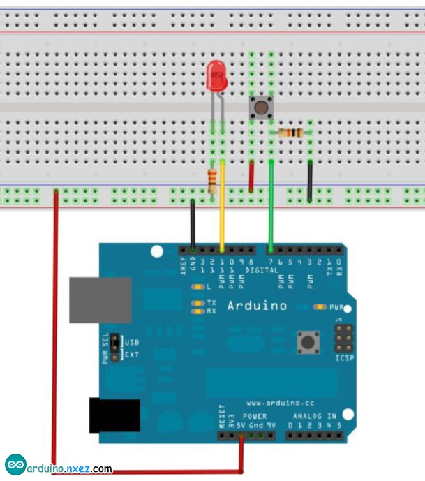

# MyArduino
Arduino练习项目
使用按键控制LED实验
这个实验我们来尝试一下使用Arduino的I/O 口的输入功能即为读取外接设备的输出值，我们用一个按键和一个LED 小灯完成一个输入输出结合使用的实验，让大家能简单了解I/O 的作用。按键开关大家都应该比较了解，属于开关量（数字量）元件，按下时为闭合（导通）状态。完成本实验要
用到的元件如下：
按键开关*1、红色M5 直插LED*1、220Ω电阻*1、10KΩ电阻*1、面包板*1、面包板跳线*1扎。

我们将按键接到数字7 接口，红色小灯接到数字11 接口（Arduino 控制器0-13 数字I/O 接口都可以用来接按键和小灯，但是尽量不选择0 和1 接口，0 和1 接口为接口功能复用，除I/O 口功能外也是串口通信接口，下载程序时属于与PC 机通信故应保持0 和1 接口悬空，所以为避免插拔线的麻烦尽量不选用0和1接口），按下面的原理图连接好电路。

下面开始编写程序，我们就让按键按下时小灯亮起，根据前面的学习相信这个程序很容易就能编写出来，相对于前面几个实验这个实验的程序中多加了一条条件判断语句，这里我们使用if 语句，Arduino 的程序便写语句是基于C 语言的，所以C 的条件判断语句自然也适用于Arduino，像while、switch 等等。这里根据个人喜好我们习惯
于使用简单易于理解的if 语句给大家做演示例程。
我们分析电路可知当按键按下时，数字7 接口可读出为高电平，这时我们使数字11 口输出高电平可使小灯亮起，程序中我们判断数字7 口是否为低电平，要为低电平使数字11 口输出也为低电平小灯不亮，原理同上。
